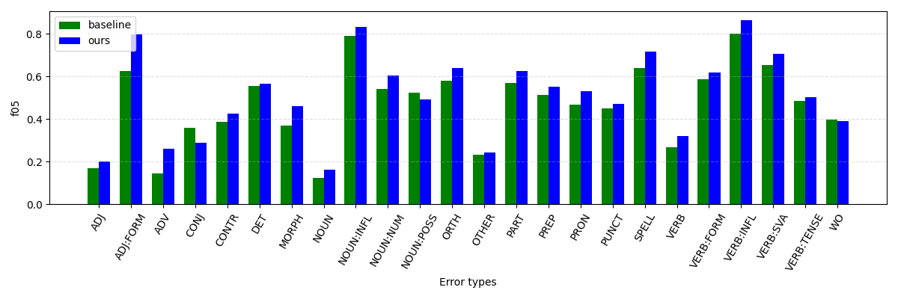

# GECOMMON: A common toolkit for Grammatical Error Correcion

This is a common toolkit for Grammatical Error Correction (GEC).

You can install it by:
```
pip install 
```

# Usage

# gecommon.Parallel

`Parallel` contains processing when paralle data is used.

### `from_parallel()`, `from_m2()`

Load parallel data from file(s) and make an instance.
```python
from gecommon import Parallel

gec = Parallel.from_parallel(
    src=<a src file path>,
    trg=<a trg file path>
)
# Or,
gec = Parallel.from_m2(
    m2=<a m2 file path>
)

# For demo,
gec = Parallel.from_demo()
'''The demo is based on:
S This are gramamtical sentence .
A 1 2|||R:VERB:SVA|||is|||REQUIRED|||-NONE-|||0
A 2 2|||M:DET|||a|||REQUIRED|||-NONE-|||0
A 2 3|||R:SPELL|||grammatical|||REQUIRED|||-NONE-|||0
A -1 -1|||noop|||-NONE-|||REQUIRED|||-NONE-|||1

S This are gramamtical sentence .
A -1 -1|||noop|||-NONE-|||REQUIRED|||-NONE-|||1

'''
```

### `show_stats(cat3: bool=False)`
Show statistics of data dataset e.g. number of sentence or word error rate.

Also show combined error types such as `R:NOUN` if `cat3 = True`.

```python
from gecommon import Parallel
gec = Parallel.from_demo()
print(gec.show_stats())
'''
Number of sents: 2
Number of words: 10
Number of edits: 3
Number of error sents: 0.5
Word error rate: 0.2
=== Cat1 ===
Error type Freq   Ratio
M               1 33.33
R               2 66.67
=== Cat2 ===
Error type Freq   Ratio
DET             1 33.33
SPELL           1 33.33
VERB:SVA        1 33.33
'''
```


### `ged_labels_sent()`

Outputs sentence-level detection labels.
```python
from gecommon import Parallel
gec = Parallel.from_demo()
print(gec.ged_labels_sent()) 
# [1, 0]
```

### `ged_labels_token()`
Outputs token-lavel error detection labels.
```python
from gecommon import Parallel
gec = Parallel.from_demo()
print(gec.ged_labels_token())
# [[0, 1, 1, 0, 0], [0, 0, 0, 0, 0]]
```

### `show_etype_stats()`

Show statistics of error types.
```python
from gecommon import Parallel
gec = Parallel.from_demo()
print(gec.show_etype_stats())
'''
Error type Freq   Ratio
DET             1 33.33
SPELL           1 33.33
VERB:SVA        1 33.33
'''
```

### `generate_corrected_srcs(n: int=1, return_labels: bool=False)`

Outputs a corrected sentences applied `n` corrections for each.  
The number of output sentences is ${}_N C_n$ where $N$ is the number of edits. 

Returns corrected error type labels if `return_labels=True`.
```python
from gecommon import Parallel
gec = Parallel.from_demo()
print(gec.generate_corrected_srcs(n=1))
# ['This is gramamtical sentence .', 'This are a gramamtical sentence .', 'This are grammatical sentence .']

print(gec.generate_corrected_srcs(n=1, return_labels=True))
# (['This is gramamtical sentence .', 'This are a gramamtical sentence .', 'This are grammatical sentence .'], [['R:VERB:SVA'], ['M:DET'], ['R:SPELL']])
```

### `def generate_corrupted_refs(self, n: int=1, return_labels: bool=False):`
Outputs a reference sentences missing `n` corrections for each.  
The number of output sentences is ${}_N C_n$ for each reference, where $N$ is the number of edits. 

Returns missing error type labels if `return_labels=True`.
```python
from gecommon import Parallel
gec = Parallel.from_demo()
print(gec.generate_corrupted_refs(n=1))
# ['This are a grammatical sentence .', 'This is grammatical sentence .', 'This is a gramamtical sentence .']

print(gec.generate_corrupted_refs(n=1, return_labels=True))
# (['This are a grammatical sentence .', 'This is grammatical sentence .', 'This is a gramamtical sentence .'], [['R:VERB:SVA'], ['M:DET'], ['R:SPELL']])
```

# gecommon.Comparison

`Comparison` performs comparison between two performance evaluation results on the ERRANT format.

### Comparison.from_errant_format(scores: List[str]=None, labels=List[str])
Load performance results and its labels.

The following example is implemented as `Comparison.from_demo()`
```python
baseline = '''===================== Span-Based Correction ======================
Category       TP       FP       FN       P        R        F0.5
ADJ            9        29       104      0.2368   0.0796   0.1698
ADJ:FORM       5        1        11       0.8333   0.3125   0.625
ADV            9        41       106      0.18     0.0783   0.1429
CONJ           10       14       34       0.4167   0.2273   0.3571
CONTR          11       17       19       0.3929   0.3667   0.3873
DET            347      234      449      0.5972   0.4359   0.5561
MORPH          32       37       126      0.4638   0.2025   0.3687
NOUN           21       107      307      0.1641   0.064    0.125
NOUN:INFL      6        1        4        0.8571   0.6      0.7895
NOUN:NUM       112      84       139      0.5714   0.4462   0.5411
NOUN:POSS      22       14       44       0.6111   0.3333   0.5238
ORTH           157      94       195      0.6255   0.446    0.5789
OTHER          122      290      858      0.2961   0.1245   0.2321
PART           20       9        40       0.6897   0.3333   0.5682
PREP           245      169      495      0.5918   0.3311   0.5113
PRON           69       71       109      0.4929   0.3876   0.4675
PUNCT          300      163      1178     0.6479   0.203    0.4505
SPELL          152      48       235      0.76     0.3928   0.6403
VERB           53       96       349      0.3557   0.1318   0.2655
VERB:FORM      125      82       111      0.6039   0.5297   0.5874
VERB:INFL      4        1        1        0.8      0.8      0.8
VERB:SVA       110      64       38       0.6322   0.7432   0.6517
VERB:TENSE     159      133      314      0.5445   0.3362   0.4845
WO             19       17       76       0.5278   0.2      0.3975

=========== Span-Based Correction ============
TP      FP      FN      Prec    Rec     F0.5
2119    1816    5342    0.5385  0.284   0.4567
==============================================
'''
ours = '''===================== Span-Based Correction ======================
Category       TP       FP       FN       P        R        F0.5
ADJ            12       35       101      0.2553   0.1062   0.1993
ADJ:FORM       7        0        9        1.0      0.4375   0.7955
ADV            21       51       94       0.2917   0.1826   0.2605
CONJ           9        19       35       0.3214   0.2045   0.2885
CONTR          11       14       19       0.44     0.3667   0.4231
DET            371      251      425      0.5965   0.4661   0.5649
MORPH          49       45       109      0.5213   0.3101   0.4588
NOUN           24       80       304      0.2308   0.0732   0.1613
NOUN:INFL      5        0        5        1.0      0.5      0.8333
NOUN:NUM       132      78       119      0.6286   0.5259   0.6049
NOUN:POSS      23       19       43       0.5476   0.3485   0.4915
ORTH           167      72       185      0.6987   0.4744   0.6384
OTHER          140      333      840      0.296    0.1429   0.2437
PART           23       8        37       0.7419   0.3833   0.625
PREP           285      178      455      0.6156   0.3851   0.5498
PRON           76       59       102      0.563    0.427    0.5292
PUNCT          330      177      1148     0.6509   0.2233   0.4706
SPELL          197      51       190      0.7944   0.5ß09    0.7143
VERB           72       109      330      0.3978   0.1791   0.3197
VERB:FORM      132      76       104      0.6346   0.5593   0.618
VERB:INFL      5        1        0        0.8333   1.0      0.8621
VERB:SVA       123      58       25       0.6796   0.8311   0.7053
VERB:TENSE     163      125      310      0.566    0.3446   0.5015
WO             17       14       78       0.5484   0.1789   0.3881

=========== Span-Based Correction ============
TP      FP      FN      Prec    Rec     F0.5
2394    1853    5067    0.5637  0.3209  0.4896
==============================================
'''
gec = Edit.from_errant_format(
    scores=[baseline, ours],
    labels=['baseline', 'ours']
)
```

### `compare(label1: str=None, label2: str=None, key: str='f05')`

Outputs the performance difference of `label2` from `label1`.
You can specify the error type's performance to be compared as `key=` from `'tp', 'fp', 'fn', 'p', 'r', 'f05'` (True Positive, False Positive, False Negative, Precision, Recall, F0.5 respectively). 

```python
from gecommon import Comparison
gec = Comparison.from_demo()
gec.compare(label1='baseline', label2='ours', key='f05')
'''
=== Overall ===
Precision: 0.5385 -> 0.5637
Recall   : 0.2840 -> 0.3209
F0.5     : 0.4567 -> 0.4896

=== Error type (key = f) ===
ADJ       :  0.1698 ->  0.1993 (+0.0295)
ADJ:FORM  :   0.625 ->  0.7955 (+0.1705)
ADV       :  0.1429 ->  0.2605 (+0.1176)
CONJ      :  0.3571 ->  0.2885 (-0.0686)
CONTR     :  0.3873 ->  0.4231 (+0.0358)
DET       :  0.5561 ->  0.5649 (+0.0088)
MORPH     :  0.3687 ->  0.4588 (+0.0901)
NOUN      :   0.125 ->  0.1613 (+0.0363)
NOUN:INFL :  0.7895 ->  0.8333 (+0.0438)
NOUN:NUM  :  0.5411 ->  0.6049 (+0.0638)
NOUN:POSS :  0.5238 ->  0.4915 (-0.0323)
ORTH      :  0.5789 ->  0.6384 (+0.0595)
OTHER     :  0.2321 ->  0.2437 (+0.0116)
PART      :  0.5682 ->   0.625 (+0.0568)
PREP      :  0.5113 ->  0.5498 (+0.0385)
PRON      :  0.4675 ->  0.5292 (+0.0617)
PUNCT     :  0.4505 ->  0.4706 (+0.0201)
SPELL     :  0.6403 ->  0.7143 (+0.074 )
VERB      :  0.2655 ->  0.3197 (+0.0542)
VERB:FORM :  0.5874 ->   0.618 (+0.0306)
VERB:INFL :     0.8 ->  0.8621 (+0.0621)
VERB:SVA  :  0.6517 ->  0.7053 (+0.0536)
VERB:TENSE:  0.4845 ->  0.5015 (+0.017 )
WO        :  0.3975 ->  0.3881 (-0.0094)
'''
```

### `plot_etype_comparison(self, labels: List[str]=None, key='f05', outpath='out.png'):`

Plot performances for each of `labels` as a bar plot.

